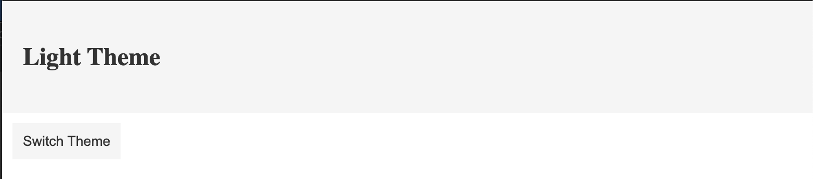
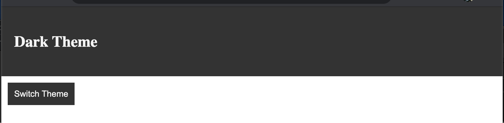

# context-hooks
This project originally created to understand contexts in hooks.The theme of the header and button is toggled from light to dark and vice versa by clicking on the button.The initial theme will be set to dark. By this simple project, the concepts of useContext is explained.

